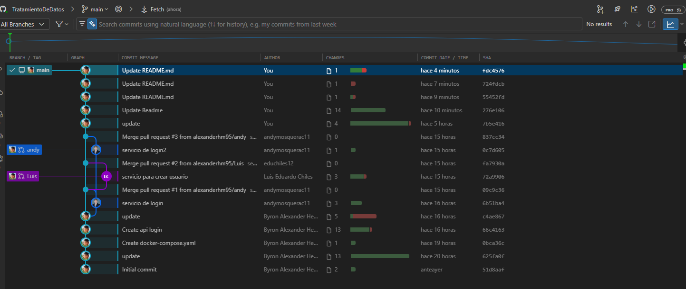
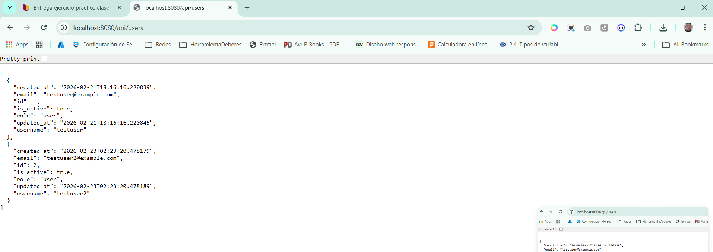
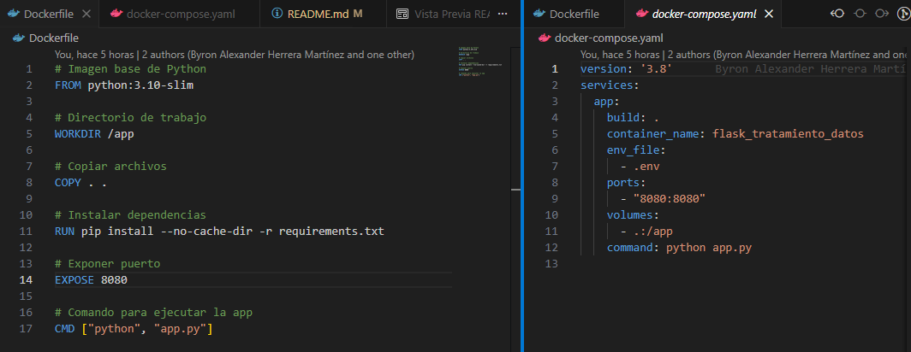
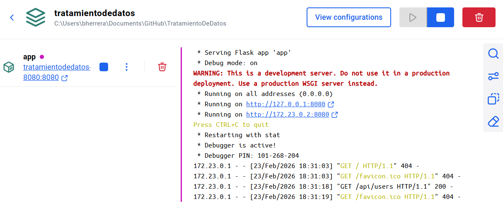
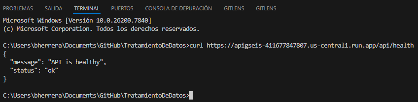
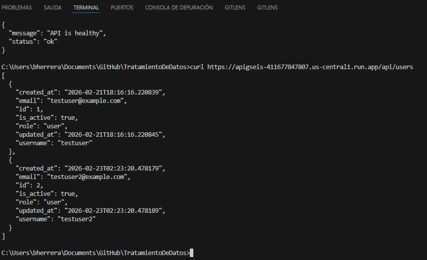
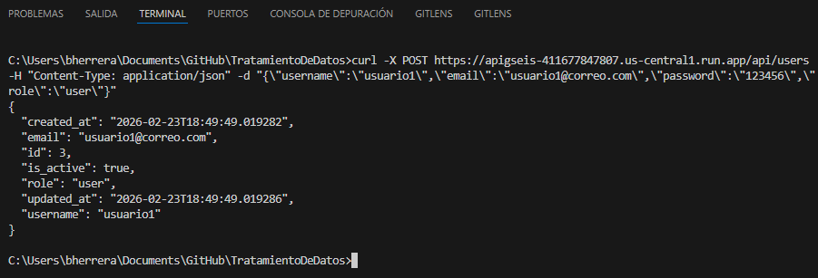
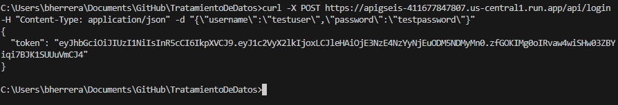
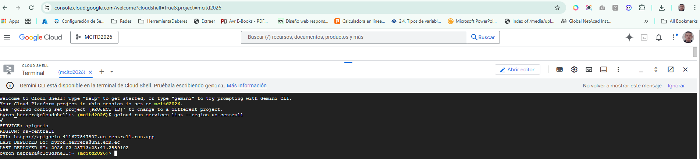
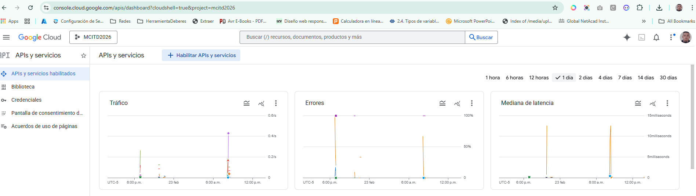

# Ejercicio Práctico Clase 2 - Grupo 6

## Profesor
**CARLOS ALBERTO VINTIMILLA CARRASCO**

## Integrantes
- ANDY FERNANDO MOSQUERA CASAMIN
- BYRON ALEXANDER HERRERA MARTINEZ
- LUIS EDUARDO CHILES QUIÑONEZ

---

## Objetivo del Ejercicio
Diseñar, construir y desplegar un **API funcional** aplicando buenas prácticas de desarrollo, versionamiento, pruebas y despliegue local usando **Flask**, integrando **Web Scraping** con **Playwright** y aplicando patrones enterprise como **Rate Limiting** y **Caching**.

### Competencias
Durante el ejercicio se utilizó correctamente:
- ✅ **GitHub** → Control de versiones y colaboración
- ✅ **Flask** → API RESTful con autenticación JWT
- ✅ **Playwright** → Web scraping avanzado
- ✅ **SQLAlchemy** → ORM y gestión de base de datos
- ✅ **Flask-JWT-Extended** → Autenticación segura
- ✅ **Docker** → Containerización y despliegue
- ✅ **Flask-Limiter** → Rate limiting para protección
- ✅ **Flask-Caching** → Mejora de rendimiento

---

## Descripción del Proyecto
API RESTful completa para gestión de usuarios con **autenticación JWT**, **web scraping integrado** y **mecanismos de seguridad enterprise**. 

### Características Implementadas
1. **Sistema de Autenticación Completo**
   - Registro de usuarios con validación de email, username y password
   - Login con generación de tokens JWT
   - Recuperación de contraseña por email (Gmail SMTP)
   - Logout con limpieza de sesión

2. **Web Scraping Integrado**
   - Scraper de cédulas de identidad (nombre → SRI API)
   - Scraper de placas vehiculares (Playwright)
   - Detección automática de APIs disponibles
   - Validación de respuestas en tiempo real

3. **Seguridad Enterprise**
   - **Rate Limiting** en endpoints sensibles
     - Login/Registro: 5 intentos por minuto
     - Recuperación de contraseña: 3 intentos por hora
     - Listar usuarios: 30 solicitudes por hora
   - **Caching** inteligente (5 minutos en GET /api/users)
   - Validación de datos con regex
   - Manejo robusto de errores

4. **Frontend Interactivo**
   - Dashboard de usuario autenticado
   - Interfaz de búsqueda de cédulas
   - Integración con servicios de scraping
   - Auto-cierre de alertas

---

## Tecnologías Utilizadas
| Capa | Tecnología | Versión |
|------|-----------|---------|
| **Backend** | Flask | 2.3.3 |
| **Autenticación** | Flask-JWT-Extended | 4.5.3 |
| **Base de Datos** | SQLAlchemy + SQLite | 1.4.x |
| **Web Scraping** | Playwright | 1.40.0 |
| **Validación** | Regex (Python) | - |
| **Seguridad** | Flask-Limiter + Flask-Caching | 3.5.0 / 2.1.0 |
| **Email** | Flask-Mail (Gmail SMTP) | 0.9.1 |
| **Contraseñas** | bcrypt (Flask-Bcrypt) | 1.0.1 |
| **Frontend** | HTML5 + Bootstrap 5.3.2 | - |
| **Containerización** | Docker | - |
| **Control de Versiones** | Git + GitHub | - |

---

## Respuesta a Preguntas del Profesor

### 1. ¿Qué consideraciones de arquitectura para escalar con usuarios crecientes?

**Horizontal Scaling & Distribuido:**
- **Cache Distribuido**: Migrar de memoria local a **Redis** para compartir cache entre múltiples instancias
  ```
  storage_uri="redis://localhost:6379" en lugar de "memory://"
  ```
- **Database Read Replicas**: Usar replicas de lectura en PostgreSQL/Cloud SQL para distribuir carga
- **Load Balancing**: Implementar Nginx o Cloud Load Balancer
- **Microservicios**: Separar scraping (workers celery) del API principal
- **CDN para Frontend**: Servir assets estáticos desde CloudFront/Cloudflare
- **Message Queue**: Implementar RabbitMQ/Celery para scraping asincrónico

**Costo Operativo:**
- Usar **Cloud Functions** para scraping bajo demanda (pago por uso)
- **Auto-scaling** en Cloud Run basado en CPU/memoria
- **Data compression** en responses JSON
- **Lazy loading** de datos en frontend

### 2. ¿Qué consideraciones para prevenir ataques de integridad e infiltración?

**Seguridad Implementada:**
- ✅ **Rate Limiting**: Previene fuerza bruta en login/registro
- ✅ **JWT Tokens**: No almacena sesiones en servidor, imposible de falsificar sin SECRET_KEY
- ✅ **bcrypt Hashing**: Contraseñas hasheadas, no reversibles
- ✅ **CORS**: Validar origen de requests
- ✅ **Validación de Input**: Regex en emails, usernames, passwords
- ✅ **SQL Injection Prevention**: SQLAlchemy ORM (queries parametrizadas)

**Mejoras Futuras Recomendadas:**
- **2FA (Two-Factor Authentication)**: Google Authenticator
- **HTTPS/TLS**: Certificado SSL en producción
- **WAF (Web Application Firewall)**: Cloud Armor en Google Cloud
- **API Key Management**: Secrets Manager (Google Cloud Secret Manager)
- **Audit Logging**: Registrar todos los accesos y cambios
- **OWASP Top 10**: Validación contra ataques XSS, CSRF
- **Database Encryption**: Encriptar datos sensibles con AES-256

### 3. ¿Qué servicio cloud preferiríamos y por qué?

**Nossa Recomendación: Google Cloud Storage + Cloud SQL + Cloud Run**

| Aspecto | Google Cloud | AWS | Azure |
|--------|------------|-----|-------|
| **Base de Datos** | Cloud SQL (PostgreSQL) | RDS | SQL Database |
| **Ventajas** | Integración nativa, backups automáticos, replicas | Ecosistema completo, EC2 flexible | Stack Microsoft |
| **Costo** | Bajo para startups | Complejo, muchos add-ons | Moderado |
| **Escalabilidad** | Excelente, auto-scaling | Superior en empresas grandes | Muy bueno |
| **Facilidad** | Muy simple, UI intuitiva | Curva de aprendizaje | Moderada |

**Configuración Recomendada para nuestro proyecto:**
```
Google Cloud SQL (PostgreSQL)
├─ Replicación en tiempo real
├─ Backups automatizados diarios
├─ Encriptación en reposo
└─ Failover automático

Cloud Run (API Container)
├─ Auto-scaling basado en tráfico
├─ HTTPS automático
├─ Pago por solicitud (0 cuando no hay tráfico)

Cloud Storage (Assets/Logs)
├─ Servir Frontend estático
├─ Logs de auditoría
```

**Vs Local:**
- ✅ **Disponibilidad**: 99.99% uptime garantizado
- ✅ **Seguridad**: Encriptación, backups, DDoS protection
- ✅ **Escalabilidad**: Crece automáticamente
- ❌ **Costo inicial**: Mayor que servidor local
- ❌ **Vendor lock-in**: Migración compleja

---

## Instalación y ejecución local
1. Clona el repositorio:
   ```bash
   git clone https://github.com/alexanderhm95/TratamientoDeDatos.git
   cd TratamientoDeDatos
   ```
2. Crea un entorno virtual:
   ```bash
   python -m venv .venv
   .venv\Scripts\activate  # En Windows
   ```
3. Instala dependencias:
   ```bash
   pip install -r requirements.txt
   ```
4. Configura variables de entorno en `.env`:
   ```env
   SECRET_KEY=tu_clave_secreta_aquí
   MAIL_USERNAME=tu_email@gmail.com
   MAIL_PASSWORD=tu_contraseña_app_gmail
   ```
5. Ejecuta la API:
   ```bash
   python app.py
   ```
6. Accede a: `http://localhost:8080`

---

## Estructura del Proyecto
```
TratamientoDeDatos/
├── app.py                  # Aplicación principal con inicialización de extensiones
├── config.py               # Configuración de Flask y extensiones
├── requirements.txt        # Dependencias del proyecto
├── Dockerfile              # Configuración para Docker
├── docker-compose.yaml     # Orquestación de servicios
├── user/                   # Módulo de autenticación
│   ├── models.py          # Modelo de Usuario (SQLAlchemy)
│   ├── routes.py          # Endpoints de usuarios (/api/users, /api/login, /api/forgot-password)
│   ├── service.py         # Lógica de negocio (crear usuario, login, etc)
│   ├── validators.py      # Validaciones de email, username, password
│   ├── exceptions.py      # Excepciones personalizadas
│   └── test.py            # Tests automatizados
├── utils/                 # Herramientas y scrapers
│   ├── scraper_cedulan.py # Web scraper para búsqueda de cédulas (Playwright)
│   └── scraper_placar.py  # Web scraper para placas vehiculares
├── services/              # Servicios complementarios
│   └── scraper_routes.py  # Endpoints de scraping (/api/verificar-api-cedula, /api/buscar-cedula)
├── templates/             # Frontend
│   ├── home.html          # Dashboard autenticado con búsqueda de cédulas
│   ├── auth/
│   │   ├── auth.html      # Formulario de login
│   │   ├── register.html  # Formulario de registro
│   │   └── forgot-password.html  # Recuperación de contraseña
├── static/                # Archivos estáticos
│   └── js/alerts.js       # Manejo de alertas con auto-cierre
└── RATE_LIMIT_CACHE.md    # Documentación de rate limiting y caching

---

## Endpoints Disponibles

### 🔐 Autenticación
| Método | Endpoint | Auth | Rate Limit | Descripción |
|--------|----------|------|-----------|-------------|
| POST | `/api/users` | ❌ | 5/min | Registro de nuevo usuario |
| POST | `/api/login` | ❌ | 5/min | Login y obtener JWT token |
| POST | `/api/forgot-password` | ❌ | 3/hora | Recuperar contraseña por email |
| GET | `/api/users` | ❌ | 30/hora | Listar usuarios (cached 5min) |

### 🔎 Web Scraping
| Método | Endpoint | Auth | Descripción |
|--------|----------|------|-------------|
| GET | `/api/verificar-api-cedula` | ❌ | Verificar disponibilidad de API SRI |
| POST | `/api/buscar-cedula` | ✅ | Buscar cédula por nombre (Scraping) |

### 🏥 Monitoreo
| Método | Endpoint | Descripción |
|--------|----------|-------------|
| GET | `/` | Dashboard principal (requiere login) |
| GET | `/api/health` | Estado de la API |

---

## Ejemplos de Uso

### 1. Registrar usuario
```bash
curl -X POST http://localhost:8080/api/users \
  -H "Content-Type: application/json" \
  -d '{
    "username": "juan123",
    "email": "juan@ejemplo.com",
    "password": "MiContraseña123!"
  }'
```

### 2. Login
```bash
curl -X POST http://localhost:8080/api/login \
  -H "Content-Type: application/json" \
  -d '{
    "username": "juan123",
    "password": "MiContraseña123!"
  }'
# Respuesta: {"access_token": "eyJhbGc..."}
```

### 3. Usar token para buscar cédula
```bash
curl -X POST http://localhost:8080/api/buscar-cedula \
  -H "Authorization: Bearer eyJhbGc..." \
  -H "Content-Type: application/json" \
  -d '{"nombre": "Juan Pérez"}'
```

### 4. Verificar disponibilidad de API
```bash
curl http://localhost:8080/api/verificar-api-cedula
# Respuesta: {"disponible": true, "mensaje": "API SRI activa"}
```

---

## Mecanismos de Seguridad Implementados

### 🛡️ Rate Limiting
Implementado con **Flask-Limiter** para prevenir abuso:
- **Login**: máximo 5 intentos por minuto (previene fuerza bruta)
- **Registro**: máximo 5 usuarios registrados por minuto
- **Recuperación de contraseña**: máximo 3 intentos por hora
- **Listar usuarios**: máximo 30 solicitudes por hora

**Respuesta HTTP 429 cuando se excede:**
```json
{
  "message": "429 Too Many Requests: 5 per 1 minute"
}
```

### 💾 Caching Inteligente
Implementado con **Flask-Caching**:
- **GET /api/users**: Caché de 5 minutos (reduce queries a BD)
- Mejora rendimiento en consultas frecuentes
- Perfecto para datos que cambian lentamente

### 🔐 Validación de Datos
- **Email**: Validación regex SMTP
- **Username**: 3-20 caracteres, solo letras/números/_/-
- **Password**: Mínimo 8 caracteres, mayúsculas, números, símbolos
- **Hashing**: bcrypt con salt (no reversible)

### 🎫 JWT Tokens
- Tokens firmados con SECRET_KEY
- No almacena sesiones en servidor
- Expiración configurable
- Imposible de falsificar

---

## Web Scraping Integrado

### Scraper de Cédulas (utils/scraper_cedulan.py)
Busca información de ciudadanos por nombre usando **Playwright** para:
1. Navegar la página SRI (Servicio de Rentas Internas)
2. Interceptar y capturar las APIs utilizadas
3. Testear automáticamente cada API encontrada
4. Devolver la información con API verificada

**Flujo:**
```
Usuario → /api/buscar-cedula con nombre
  ↓
Playwright abre navegador (headless)
  ↓
Navega SRI, cierra popups, ingresa búsqueda
  ↓
Captura APIs interceptadas por Playwright
  ↓
Testea cada API encontrada
  ↓
Retorna: cedula, nombre, tipo, clase, API verificada
```

### Scraper de Placas (utils/scraper_placar.py)
Similar al anterior pero para búsqueda de placas vehiculares.

---

## Testing
Ejecuta las pruebas unitarias:
```bash
python user/test.py
```

---

## Manejo de errores
Respuestas de error en formato JSON con códigos descriptivos:
- `400 Bad Request`: Validación fallida
- `401 Unauthorized`: Token JWT inválido/expirado
- `429 Too Many Requests`: Rate limit excedido
- `500 Internal Server Error`: Error del servidor

Ejemplos:
```json
{
  "message": "Invalid credentials"
}
```

```json
{
  "message": "El nombre de usuario ya existe."
}
```

---

## Despliegue en Google Cloud Run
1. Autentica y configura Google Cloud SDK:
   ```bash
   gcloud auth login
   gcloud config set project mcitd2026
   ```

2. Construye y sube la imagen a Google Container Registry:
   ```bash
   gcloud builds submit --tag gcr.io/mcitd2026/tratamiento-datos
   ```

3. Despliega en Cloud Run:
   ```bash
   gcloud run deploy tratamiento-datos \
     --image gcr.io/mcitd2026/tratamiento-datos \
     --platform managed \
     --region us-central1 \
     --allow-unauthenticated \
     --set-env-vars SECRET_KEY=tu_clave_secreta
   ```

4. Accede a la API desde Cloud Run (URL proporcionada en output)

---

## Mejoras Futuras (Roadmap)
- [ ] Implementar 2FA (Two-Factor Authentication)
- [ ] Migrar cache a Redis para múltiples instancias
- [ ] Usar PostgreSQL en lugar de SQLite
- [ ] Implementar API Key management
- [ ] Agregar audit logging de todos los accesos
- [ ] Certificados SSL/TLS automáticos
- [ ] Dashboard de administración (admin panel)
- [ ] Scraper para más fuentes de datos
- [ ] API versioning (v1, v2, etc)
- [ ] GraphQL endpoint

---

## Evidencia Ejecutada

### Branches y control de versiones

<div align="center">
  
</div>

### API funcionando localmente

<div align="center">
  
</div>

### Construcción de imagen Docker

<div align="center">
  
</div>

### Contenedor ejecutándose

<div align="center">
  
</div>

### Pruebas de API (curl)

<div align="center">
  
</div>

<div align="center">
  
</div>

<div align="center">
  
</div>

<div align="center">
  
</div>

### API desplegada en Cloud

<div align="center">
  
</div>

<div align="center">
  
</div>

---

## 📦 Entregables Requeridos

### Parte 1 - Construcción del API 
**Repositorio Principal:** [TratamientoDeDatos](https://github.com/alexanderhm95/TratamientoDeDatos)

**Incluye:**
- ✅ Código fuente completo del API (Flask + autenticación JWT)
- ✅ README documentado con ejemplos de uso
- ✅ Sistema de autenticación (registro, login, recuperación de contraseña)
- ✅ Web Scraping integrado (Playwright)
- ✅ Rate Limiting y Caching implementados
- ✅ Validación de datos
- ✅ Tests unitarios
- ✅ Dockerfile y docker-compose
- ✅ Respuestas JSON bien estructuradas
- ✅ Buenas prácticas de versionamiento Git

**Creatividad & Features Extra:**
- 🚀 Sistema completo de autenticación con recuperación por email
- 🔍 Web scraping con Playwright (detecta y testea APIs automáticamente)
- 🛡️ Rate limiting y caching para protección
- 📊 Validación avanzada de datos (regex)
- 🎨 Frontend interactivo con Bootstrap
- 📈 Logging y manejo robusto de errores

### Parte 2 - Web Scraping
**Repositorio Separado:** [Scraper - Cédulas y Placas](https://github.com/alexanderhm95/TratamientoDeDatos/tree/main/utils)

**Página pública scrappeada:**
- 🇪🇨 **SRI (Servicio de Rentas Internas)** - https://www.sri.gob.ec/
- **Datos extraídos:** Cédula, nombre, tipo de identificación, clase

**Proceso:**
1. ✅ Extrae datos estructurados usando Playwright
2. ✅ Limpia y procesa datos (valida cédulas, nombres)
3. ✅ Detecta y testea APIs interceptadas
4. ✅ Integrado con API (endpoint /api/buscar-cedula)

**Dificultad:**
⭐⭐⭐⭐⭐ (5/5) - Página con JavaScript dinámico, requiere:
- Browser automation (Playwright headless)
- Interceptación de Network requests
- Detección automática de APIs
- Validación de respuestas en tiempo real
- Manejo de popups y elementos dinámicos

---

## 📄 Licencia
Proyecto educativo - Técnico Superior en Análisis de Datos (MCITD 2026)

---

## 📞 Contacto & Preguntas
Para consultas sobre la construcción del API o web scraping:
📧 Contactar al **Profesor CARLOS ALBERTO VINTIMILLA CARRASCO**

---

**Última actualización:** 2 de marzo de 2026  
**Estado:** Desarrollo completado y listo para evaluación