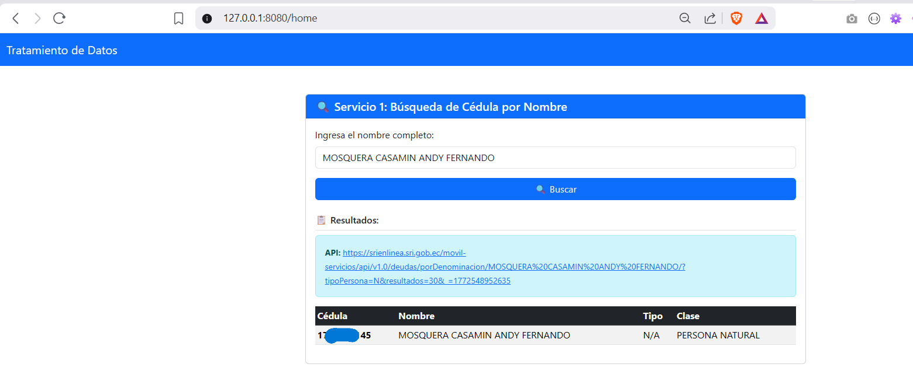
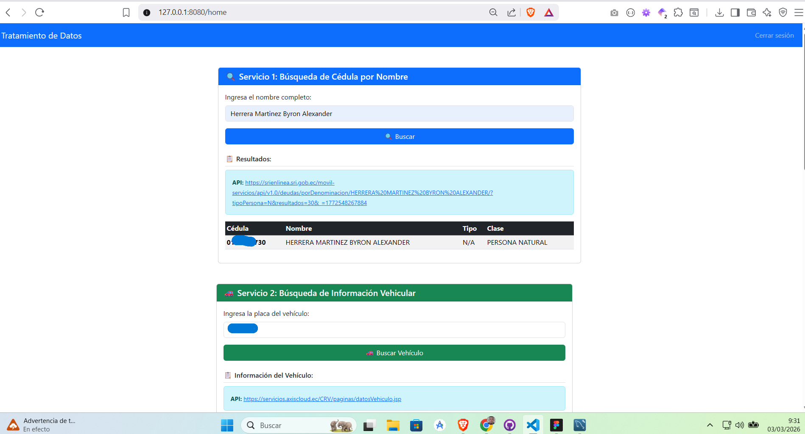
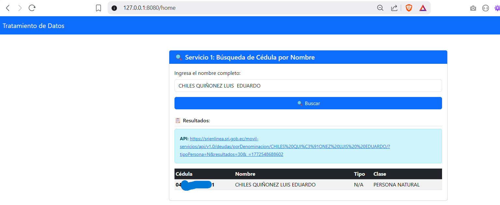
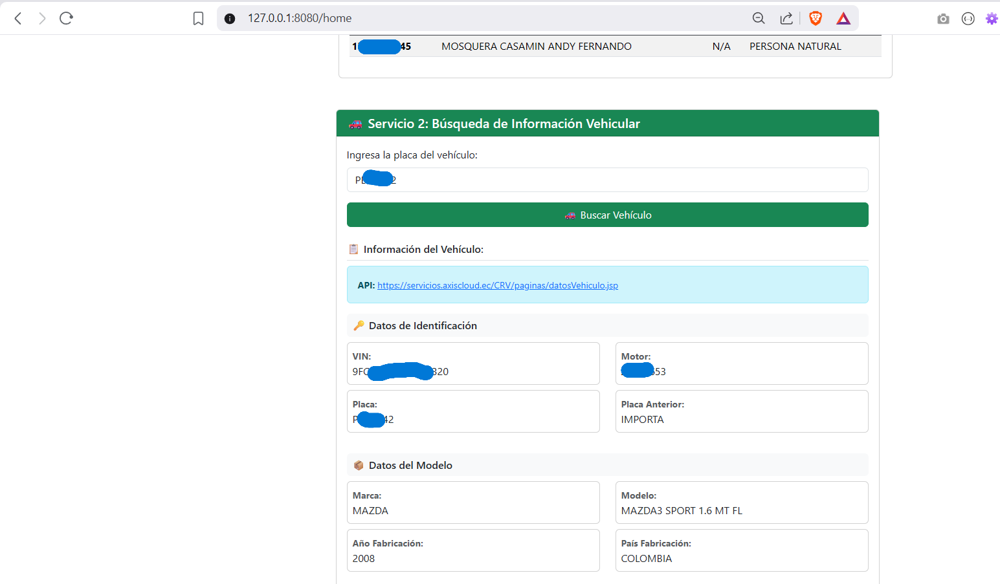
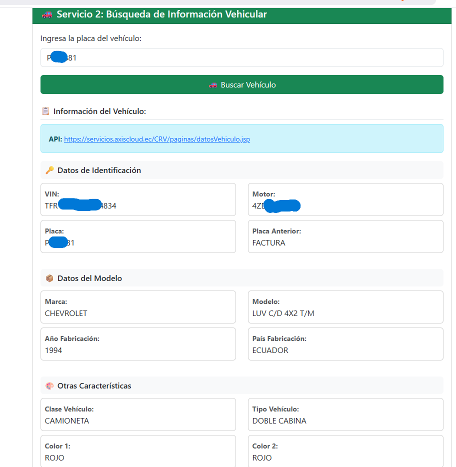
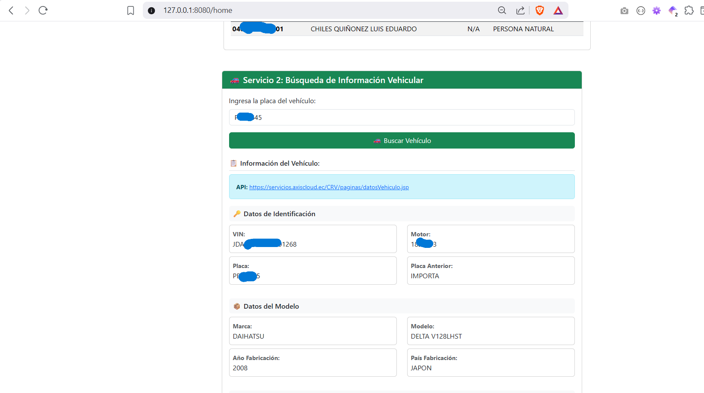

# Ejercicio Práctico Clase 2 - Grupo 6

## Profesor
**CARLOS ALBERTO VINTIMILLA CARRASCO**

## Integrantes
- ANDY FERNANDO MOSQUERA CASAMIN
- BYRON ALEXANDER HERRERA MARTINEZ
- LUIS EDUARDO CHILES QUIÑONEZ

---

## Objetivo del Ejercicio
Diseñar, construir y desplegar un **API funcional** aplicando buenas prácticas de desarrollo, versionamiento, pruebas y despliegue local usando **Flask**, integrando **Web Scraping** con **Playwright** y aplicando patrones enterprise como **Rate Limiting** y **Caching**.

### Competencias
Durante el ejercicio se utilizó correctamente:
- ✅ **GitHub** → Control de versiones y colaboración
- ✅ **Flask** → API RESTful con autenticación JWT
- ✅ **Playwright** → Web scraping avanzado
- ✅ **SQLAlchemy** → ORM y gestión de base de datos
- ✅ **Flask-JWT-Extended** → Autenticación segura
- ✅ **Docker** → Containerización y despliegue
- ✅ **Flask-Limiter** → Rate limiting para protección
- ✅ **Flask-Caching** → Mejora de rendimiento

---

## Descripción del Proyecto
API RESTful completa para gestión de usuarios con **autenticación JWT**, **web scraping integrado** y **mecanismos de seguridad enterprise**. 

### Características Implementadas
1. **Sistema de Autenticación Completo**
   - Registro de usuarios con validación de email, username y password
   - Login con generación de tokens JWT
   - Recuperación de contraseña por email (Gmail SMTP)
   - Logout con limpieza de sesión

2. **Web Scraping Integrado**
   - Scraper de cédulas de identidad (nombre → SRI API)
   - Scraper de placas vehiculares (Playwright)
   - Detección automática de APIs disponibles
   - Validación de respuestas en tiempo real

3. **Seguridad Enterprise**
   - **Rate Limiting** en endpoints sensibles
     - Login/Registro: 5 intentos por minuto
     - Recuperación de contraseña: 3 intentos por hora
     - Listar usuarios: 30 solicitudes por hora
   - **Caching** inteligente (5 minutos en GET /api/users)
   - Validación de datos con regex
   - Manejo robusto de errores

4. **Frontend Interactivo**
   - Dashboard de usuario autenticado
   - Interfaz de búsqueda de cédulas
   - Integración con servicios de scraping
   - Auto-cierre de alertas

---

## Tecnologías Utilizadas
| Capa | Tecnología | Versión |
|------|-----------|---------|
| **Backend** | Flask | 2.3.3 |
| **Autenticación** | Flask-JWT-Extended | 4.5.3 |
| **Base de Datos** | SQLAlchemy + SQLite | 1.4.x |
| **Web Scraping** | Playwright | 1.40.0 |
| **Validación** | Regex (Python) | - |
| **Seguridad** | Flask-Limiter + Flask-Caching | 3.5.0 / 2.1.0 |
| **Email** | Flask-Mail (Gmail SMTP) | 0.9.1 |
| **Contraseñas** | bcrypt (Flask-Bcrypt) | 1.0.1 |
| **Frontend** | HTML5 + Bootstrap 5.3.2 | - |
| **Containerización** | Docker | - |
| **Control de Versiones** | Git + GitHub | - |

---

## Mejoras aplicadas

**Seguridad Implementada:**
- ✅ **Rate Limiting**: Previene fuerza bruta en login/registro
- ✅ **JWT Tokens**: No almacena sesiones en servidor, imposible de falsificar sin SECRET_KEY
- ✅ **bcrypt Hashing**: Contraseñas hasheadas, no reversibles
- ✅ **CORS**: Validar origen de requests
- ✅ **Validación de Input**: Regex en emails, usernames, passwords
- ✅ **SQL Injection Prevention**: SQLAlchemy ORM (queries parametrizadas)


---

## Instalación y ejecución local
1. Clona el repositorio:
   ```bash
   git clone https://github.com/alexanderhm95/TratamientoDeDatos.git
   cd TratamientoDeDatos
   ```
2. Crea un entorno virtual:
   ```bash
   python -m venv .venv
   .venv\Scripts\activate  # En Windows
   ```
3. Instala dependencias:
   ```bash
   pip install -r requirements.txt
   ```
4. Configura variables de entorno en `.env`:
   ```env
   SECRET_KEY=tu_clave_secreta_aquí
   MAIL_USERNAME=tu_email@gmail.com
   MAIL_PASSWORD=tu_contraseña_app_gmail
   ```
5. Ejecuta la API:
   ```bash
   python app.py
   ```
6. Accede a: `http://localhost:8080`

---

## Estructura del Proyecto
```
TratamientoDeDatos/
├── app.py                      # Aplicación principal con inicialización de extensiones (Flask, JWT, Cache, Limiter)
├── config.py                   # Configuración de Flask y extensiones
├── requirements.txt            # Dependencias del proyecto (Flask, JWT, Caching, Limiter, Playwright, etc)
├── install_playwright_browsers.py  # Script para instalar navegadores Playwright
├── Dockerfile                  # Configuración para Docker
├── docker-compose.yaml         # Orquestación de servicios
├── app.db                      # Base de datos SQLite (usuarios)
├── .env                        # Variables de entorno (secretas)
│
├── user/                       # 🔐 Módulo de autenticación y usuarios
│   ├── __init__.py
│   ├── models.py              # Modelo de Usuario (SQLAlchemy)
│   ├── routes.py              # Endpoints de autenticación (@cache.cached, @limiter.limit)
│   │                          # POST /api/users (registro, rate limit 5/min)
│   │                          # GET /api/users (listar, CACHED 5min, rate limit 30/hora)
│   │                          # POST /api/login (login, rate limit 5/min)
│   │                          # POST /api/forgot-password (recuperar contraseña, rate limit 3/hora)
│   ├── service.py             # Lógica de negocio (crear usuario, login, validaciones)
│   ├── validators.py          # Validaciones con regex (email, username, password)
│   ├── exceptions.py          # Excepciones personalizadas
│   ├── test.py                # Tests unitarios
│   └── __pycache__/
│
├── services/                   # 🌐 Servicios de scraping y APIs externas
│   ├── __init__.py
│   ├── scraper_routes.py      # Endpoints de web scraping
│   │                          # GET /api/verificar-api-cedula (verificar disponibilidad SRI)
│   │                          # POST /api/buscar-cedula (buscar cédula por nombre, auth requerida)
│   │                          # POST /api/buscar-vehiculo (buscar vehículo por placa, auth requerida)
│   └── __pycache__/
│
├── utils/                      # 🔧 Herramientas y web scrapers con Playwright
│   ├── scraper_cedulan.py     # Scraper para búsqueda de cédulas (SRI)
│   │                          # Clase: CedulaScraper
│   │                          # Método: scrape_cedula(nombre)
│   │                          # Captura: APIs del SRI, parsea respuestas JSON
│   │
│   ├── scraper_vehiculo.py    # Scraper para información vehicular (CRV)
│   │                          # Clase: VehiculoScraper
│   │                          # Método: scrape_cedula(placa)
│   │                          # Captura: Datos completos del vehículo
│   │
│   ├── scraper_placar.py      # Scraper para propietarios por placa (ANT)
│   │                          # Clase: VehicleScraperANT
│   │                          # Método: scrape_vehicle(placa)
│   │
│   ├── scraper_pointsc.py     # Scraper para puntos de licencia
│   │                          # Clase: CedulaScraper
│   │                          # Método: scrape_cedula(cedula)
│   │
│   └── __pycache__/
│
├── templates/                  # 📄 Frontend HTML con Bootstrap 5.3.2
│   ├── home.html              # Dashboard autenticado (búsqueda cédulas + vehículos)
│   │                          # Formulario de búsqueda de cédulas
│   │                          # Formulario de búsqueda vehicular (placa)
│   │                          # Muestra resultados con datos completos
│   │
│   ├── auth/
│   │   ├── auth.html          # Formulario de login
│   │   ├── register.html      # Formulario de registro con validaciones
│   │   └── forgot-password.html  # Recuperación de contraseña por email
│   │
│   ├── js/
│   │   └── alerts.js          # Manejo de alertas con auto-cierre
│   │
│   └── user/
│       └── createuser.html    # Página de creación de usuario
│
├── static/                     # 🎨 Archivos estáticos
│   ├── js/
│   │   └── alerts.js          # Funciones de alerta (auto-cierre, estilos)
│   └── [otros assets CSS/JS]
│
├── evidencia/                  # 📸 Capturas de pantalla de pruebas
│   ├── Servicio1_AM.png       # Búsqueda cédula - ANDY MOSQUERA
│   ├── Servicio1_BH.png       # Búsqueda cédula - BYRON HERRERA
│   ├── Servicio1_LC.png       # Búsqueda cédula - LUIS CHILES
│   ├── Servicio2_AM.png       # Búsqueda vehículo - ANDY MOSQUERA
│   ├── Servicio2_BH.png       # Búsqueda vehículo - BYRON HERRERA
│   ├── Servicio2_LC.png       # Búsqueda vehículo - LUIS CHILES
│   ├── branch.png             # Control de versiones Git
│   ├── buildDocker.png        # Construcción de imagen Docker
│   ├── cloud.png              # Despliegue en Google Cloud
│   ├── cloud2.png             # Dashboard de Google Cloud
│   ├── createUser.png         # Prueba: crear usuario
│   ├── docker.png             # Contenedor Docker ejecutándose
│   ├── health.png             # Prueba: health check API
│   ├── listUsers.png          # Prueba: listar usuarios
│   ├── localhost.png          # API corriendo en localhost
│   └── login.png              # Prueba: login de usuario
│
└── __pycache__/               # Cache de Python (compilado bytecode)

---

## Endpoints Disponibles

### 🔐 Autenticación
| Método | Endpoint | Auth | Rate Limit | Cache | Descripción |
|--------|----------|------|-----------|-------|-------------|
| POST | `/api/users` | ❌ | 5/min | ❌ | Registro de nuevo usuario |
| POST | `/api/login` | ❌ | 5/min | ❌ | Login y obtener JWT token |
| POST | `/api/forgot-password` | ❌ | 3/hora | ❌ | Recuperar contraseña por email |
| GET | `/api/users` | ❌ | 30/hora | ✅ 5min | Listar usuarios (cached) |

### 🔎 Web Scraping - Cédulas
| Método | Endpoint | Auth | Cache | Descripción |
|--------|----------|------|-------|-------------|
| GET | `/api/verificar-api-cedula` | ❌ | ❌ | Verificar disponibilidad de API SRI |
| POST | `/api/buscar-cedula` | ✅ | ❌ | Buscar cédula por nombre (Playwright) |

**Request:**
```json
{
  "nombre": "Juan Pérez González"
}
```

**Response:**
```json
{
  "api_url": "https://apps.ecuadorlegalonline.com/modulo/consultar-cedulanombre.php?nombres=...",
  "cedulas": [
    {
      "identificacion": "0123456789",
      "nombreComercial": "JUAN PÉREZ GONZÁLEZ",
      "tipo": "PERSONA NATURAL",
      "clase": "NACIONAL"
    }
  ],
  "nombre_buscado": "Juan Pérez González",
  "timestamp": "2026-03-03T10:30:45.123456"
}
```

---

### 🚗 Web Scraping - Vehículos
| Método | Endpoint | Auth | Cache | Descripción |
|--------|----------|------|-------|-------------|
| POST | `/api/buscar-vehiculo` | ✅ | ❌ | Buscar información vehicular por placa (CRV) |

**Request:**
```json
{
  "placa": "PSE0881"
}
```

**Response:**
```json
{
  "api_url": "https://servicios.axiscloud.ec/CRV/paginas/datosVehiculo.jsp",
  "vehiculo": {
    "codError": "0",
    "campos": {
      "lsUltimaActualizacion": "",
      "lsServicio": "USO PARTICULAR",
      "lsPlaca": "PSE0881",
      "lsDatosIdentificacion": [
        {
          "valor": "TFR16HD947104834",
          "etiqueta": "VIN:"
        },
        {
          "valor": "4ZD1315991",
          "etiqueta": "Motor:"
        }
      ],
      "lsDatosModelo": [
        {
          "valor": "CHEVROLET",
          "etiqueta": "Marca:"
        },
        {
          "valor": "LUV C/D 4X2 T/M",
          "etiqueta": "Modelo:"
        }
      ],
      "lsOtrasCaracteristicas": [
        {
          "valor": "CAMIONETA",
          "etiqueta": "Clase Vehículo:"
        },
        {
          "valor": "ROJO",
          "etiqueta": "Color 1:"
        }
      ]
    }
  },
  "placa_buscada": "PSE0881",
  "timestamp": "2026-03-03T10:35:20.654321",
  "estado": "exitoso"
}
```

---

### 🏥 Monitoreo & Salud
| Método | Endpoint | Auth | Descripción |
|--------|----------|------|-------------|
| GET | `/` | ✅ | Dashboard principal (requiere autenticación JWT) |
| GET | `/api/health` | ❌ | Estado de la API |
| GET | `/login` | ❌ | Página de login |
| GET | `/register` | ❌ | Página de registro |
| GET | `/forgot-password` | ❌ | Página de recuperación de contraseña |

**Response /api/health:**
```json
{
  "status": "ok",
  "message": "API is healthy"
}
```

---

## Ejemplos de Uso

### 1. Verificar estado de la API
```bash
curl http://localhost:8080/api/health
```
**Respuesta:**
```json
{
  "status": "ok",
  "message": "API is healthy"
}
```

### 2. Registrar usuario
```bash
curl -X POST http://localhost:8080/api/users \
  -H "Content-Type: application/json" \
  -d '{
    "username": "juan123",
    "email": "juan@ejemplo.com",
    "password": "MiContraseña123!"
  }'
```
**Respuesta (201 Created):**
```json
{
  "user_id": 1,
  "username": "juan123",
  "email": "juan@ejemplo.com",
  "role": "user",
  "created_at": "2026-03-03T10:00:00.000000"
}
```

### 3. Login - Obtener JWT token
```bash
curl -X POST http://localhost:8080/api/login \
  -H "Content-Type: application/json" \
  -d '{
    "username": "juan123",
    "password": "MiContraseña123!"
  }'
```
**Respuesta (200 OK):**
```json
{
  "access_token": "eyJhbGciOiJIUzI1NiIsInR5cCI6IkpXVCJ9...",
  "token_type": "Bearer"
}
```

### 4. Listar usuarios (con Cache de 5 minutos)
```bash
curl http://localhost:8080/api/users \
  -H "Authorization: Bearer eyJhbGc..."
```
**Respuesta (200 OK):**
```json
[
  {
    "user_id": 1,
    "username": "juan123",
    "email": "juan@ejemplo.com",
    "role": "user"
  }
]
```
*Nota: Las siguientes 5 minutos, esta respuesta se devuelve desde cache sin acceder a la BD*

### 5. Buscar cédula por nombre (con Web Scraping)
```bash
curl -X POST http://localhost:8080/api/buscar-cedula \
  -H "Authorization: Bearer eyJhbGc..." \
  -H "Content-Type: application/json" \
  -d '{"nombre": "Juan Pérez"}'
```
**Respuesta (200 OK):**
```json
{
  "api_url": "https://apps.ecuadorlegalonline.com/modulo/consultar-cedulanombre.php?nombres=...",
  "cedulas": [
    {
      "identificacion": "0123456789",
      "nombreComercial": "JUAN PÉREZ GARCÍA",
      "tipo": "PERSONA NATURAL",
      "clase": "NACIONAL"
    }
  ],
  "nombre_buscado": "Juan Pérez",
  "timestamp": "2026-03-03T10:30:45.123456"
}
```

### 6. Buscar información vehicular por placa
```bash
curl -X POST http://localhost:8080/api/buscar-vehiculo \
  -H "Authorization: Bearer eyJhbGc..." \
  -H "Content-Type: application/json" \
  -d '{"placa": "PSE0881"}'
```
**Respuesta (200 OK):**
```json
{
  "api_url": "https://servicios.axiscloud.ec/CRV/paginas/datosVehiculo.jsp",
  "vehiculo": {
    "codError": "0",
    "campos": {
      "lsPlaca": "PSE0881",
      "lsDatosIdentificacion": [
        {"valor": "TFR16HD947104834", "etiqueta": "VIN:"},
        {"valor": "4ZD1315991", "etiqueta": "Motor:"}
      ],
      "lsDatosModelo": [
        {"valor": "CHEVROLET", "etiqueta": "Marca:"},
        {"valor": "LUV C/D 4X2 T/M", "etiqueta": "Modelo:"}
      ]
    }
  },
  "placa_buscada": "PSE0881",
  "timestamp": "2026-03-03T10:35:20.654321",
  "estado": "exitoso"
}
```

### 7. Verificar disponibilidad de API SRI
```bash
curl http://localhost:8080/api/verificar-api-cedula
```
**Respuesta (200 OK):**
```json
{
  "disponible": true,
  "mensaje": "API disponible",
  "servicio": "busqueda-cedula"
}
```

### 8. Recuperar contraseña por email
```bash
curl -X POST http://localhost:8080/api/forgot-password \
  -H "Content-Type: application/json" \
  -d '{"email": "juan@ejemplo.com"}'
```
**Respuesta (200 OK):**
```json
{
  "message": "Email de recuperación enviado a juan@ejemplo.com"
}
```

---

## Códigos de Error HTTP

| Código | Significado | Ejemplo |
|--------|------------|---------|
| **200** | OK | Solicitud exitosa |
| **201** | Created | Usuario creado exitosamente |
| **400** | Bad Request | Datos inválidos (email mal formato, password muy corta) |
| **401** | Unauthorized | Token JWT inválido/expirado/no proporcionado |
| **429** | Too Many Requests | Límite de rate limit excedido |
| **500** | Internal Server Error | Error interno del servidor |

**Ejemplo de error 400:**
```json
{
  "message": "El nombre de usuario debe tener entre 3 y 20 caracteres."
}
```

**Ejemplo de error 429:**
```json
{
  "message": "429 Too Many Requests: 5 per 1 minute"
}
```

---

## Mecanismos de Seguridad Implementados

### 🛡️ Rate Limiting
Implementado con **Flask-Limiter** para prevenir abuso:
- **Login**: máximo 5 intentos por minuto (previene fuerza bruta)
- **Registro**: máximo 5 usuarios registrados por minuto
- **Recuperación de contraseña**: máximo 3 intentos por hora
- **Listar usuarios**: máximo 30 solicitudes por hora

**Respuesta HTTP 429 cuando se excede:**
```json
{
  "message": "429 Too Many Requests: 5 per 1 minute"
}
```

### 💾 Caching Inteligente
Implementado con **Flask-Caching**:
- **GET /api/users**: Caché de 5 minutos (reduce queries a BD)
- Mejora rendimiento en consultas frecuentes
- Perfecto para datos que cambian lentamente

### 🔐 Validación de Datos
- **Email**: Validación regex SMTP
- **Username**: 3-20 caracteres, solo letras/números/_/-
- **Password**: Mínimo 8 caracteres, mayúsculas, números, símbolos
- **Hashing**: bcrypt con salt (no reversible)

### 🎫 JWT Tokens
- Tokens firmados con SECRET_KEY
- No almacena sesiones en servidor
- Expiración configurable
- Imposible de falsificar

---

## Web Scraping Integrado

### Scraper de Cédulas (utils/scraper_cedulan.py)
Busca información de ciudadanos por nombre usando **Playwright** para:
1. Navegar la página SRI (Servicio de Rentas Internas)
2. Interceptar y capturar las APIs utilizadas
3. Testear automáticamente cada API encontrada
4. Devolver la información con API verificada

**Flujo:**
```
Usuario → /api/buscar-cedula con nombre
  ↓
Playwright abre navegador (headless)
  ↓
Navega SRI, cierra popups, ingresa búsqueda
  ↓
Captura APIs interceptadas por Playwright
  ↓
Testea cada API encontrada
  ↓
Retorna: cedula, nombre, tipo, clase, API verificada
```

### Scraper de Placas (utils/scraper_placar.py)
Similar al anterior pero para búsqueda de placas vehiculares.

---

## Testing
Ejecuta las pruebas unitarias:
```bash
python user/test.py
```

---

## Manejo de errores
Respuestas de error en formato JSON con códigos descriptivos:
- `400 Bad Request`: Validación fallida
- `401 Unauthorized`: Token JWT inválido/expirado
- `429 Too Many Requests`: Rate limit excedido
- `500 Internal Server Error`: Error del servidor

Ejemplos:
```json
{
  "message": "Invalid credentials"
}
```

```json
{
  "message": "El nombre de usuario ya existe."
}
```

---

## Despliegue en Google Cloud Run
1. Autentica y configura Google Cloud SDK:
   ```bash
   gcloud auth login
   gcloud config set project mcitd2026
   ```

2. Construye y sube la imagen a Google Container Registry:
   ```bash
   gcloud builds submit --tag gcr.io/mcitd2026/tratamiento-datos
   ```

3. Despliega en Cloud Run:
   ```bash
   gcloud run deploy tratamiento-datos \
     --image gcr.io/mcitd2026/tratamiento-datos \
     --platform managed \
     --region us-central1 \
     --allow-unauthenticated \
     --set-env-vars SECRET_KEY=tu_clave_secreta
   ```

4. Accede a la API desde Cloud Run (URL proporcionada en output)


## Evidencia Ejecutada

### Branches y control de versiones

<div align="center">
  
</div>

### API funcionando localmente

<div align="center">
  
</div>

### Construcción de imagen Docker

<div align="center">
  
</div>

### Contenedor ejecutándose

<div align="center">
  
</div>

### Pruebas de API (curl)

<div align="center">
  
</div>

<div align="center">
  
</div>

<div align="center">
  
</div>

<div align="center">
  
</div>

### API desplegada en Cloud

<div align="center">
  
</div>

<div align="center">
  
</div>

---

## 📦 Entregables Requeridos

### Parte 1- Proyecto 
**Repositorio Principal:** [TratamientoDeDatos](https://github.com/alexanderhm95/TratamientoDeDatos)

**Incluye:**
- ✅ Código fuente completo del API (Flask + autenticación JWT)
- ✅ README documentado con ejemplos de uso
- ✅ Sistema de autenticación (registro, login, recuperación de contraseña)
- ✅ Web Scraping integrado (Playwright)
- ✅ Rate Limiting y Caching implementados
- ✅ Validación de datos
- ✅ Tests unitarios
- ✅ Dockerfile y docker-compose
- ✅ Respuestas JSON bien estructuradas
- ✅ Buenas prácticas de versionamiento Git


### Parte 2 - Web Scraping
**Repositorio Separado:** [Scraper - Cédulas y Placas](https://github.com/alexanderhm95/TratamientoDeDatos/tree/main/utils)

**Página pública scrappeada:**
- 🇪🇨 **SRI (Servicio de Rentas Internas)** - https://www.sri.gob.ec/
- **Datos extraídos:** Cédula, nombre, tipo de identificación, clase

**Proceso:**
1. ✅ Extrae datos estructurados usando Playwright
2. ✅ Limpia y procesa datos (valida cédulas, nombres)
3. ✅ Detecta y testea APIs interceptadas
4. ✅ Integrado con API (endpoint /api/buscar-cedula)

---

## � Evidencia - Servicios de Web Scraping Implementados

### 🔍 Servicio 1: Búsqueda de Cédula por Nombre
**Descripción:** API que permite buscar cédulas de identidad de personas por nombre utilizando web scraping del SRI (Servicio de Rentas Internas).

**Evidencia de ejecución:**

#### ANDY FERNANDO MOSQUERA CASAMIN


#### BYRON ALEXANDER HERRERA MARTINEZ


#### LUIS EDUARDO CHILES QUIÑONEZ


---

### 🚗 Servicio 2: Búsqueda de Información Vehicular
**Descripción:** API que consume información de vehículos por placa del Registro Civil de Ecuador (CRV), interceptando respuestas de APIs externas mediante Playwright y capturando datos completos del vehículo.

**Características:**
- Búsqueda por placa vehicular
- Extracción de datos de identificación (VIN, Motor)
- Información del modelo (Marca, Modelo, Año)
- Características vehiculares (Tipo, Color, Peso)
- Estado de registro (CRV, Retención)
- Información de revisión técnica

**Evidencia de ejecución:**

#### ANDY FERNANDO MOSQUERA CASAMIN


#### BYRON ALEXANDER HERRERA MARTINEZ


#### LUIS EDUARDO CHILES QUIÑONEZ


